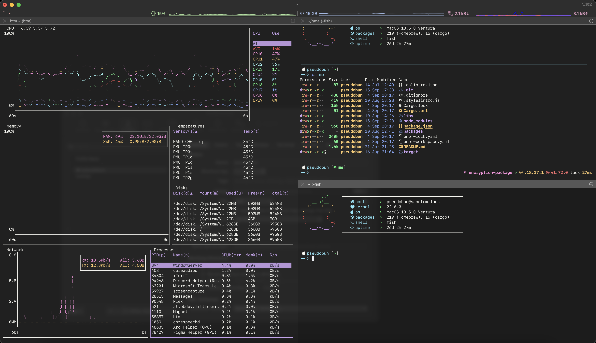

# pseudobun's dotfiles

This repository contains dotfiles and images for my workspace (iTerm config and desktop wallpapers). Wallpaper assets used have been downloaded from [Ethereum's official Assets site](https://ethereum.org/en/assets/).

## Bootstrapping:

Run this command to bootstrap your machine:

```
/bin/bash -c "$(curl -fsSL https://raw.githubusercontent.com/pseudobun/dotfiles/main/bootstrap.sh)"
```

> Note: 
> Some of the commands in the script require `sudo` access. You will be prompted for your password. 
> Some features (such as omf installation) are currently experimental.

Currently, [Go](https://go.dev/) needs to be installed [manually](https://go.dev/doc/install).

## TODOs

* [ ] Add option to generate new GPG key pair/import it from file and set it to default for git.
* [ ] Add option to generate new SSH key pair/import it from file and add it to SSH agent.
* [ ] Installing Go
* [ ] Installing and configuring yabai with skhd

## Configuration in action:




## Some of the tools I use:

* [iTerm2](https://iterm2.com/)
* [fish](https://github.com/fish-shell/fish-shell)
* [oh-my-fish](https://github.com/oh-my-fish/oh-my-fish)
* [Raycast](https://www.raycast.com/)
* [yabai](https://github.com/koekeishiya/yabai)
* [modern UNIX tools](https://github.com/ibraheemdev/modern-unix)
* [pyenv](https://github.com/pyenv/pyenv)

> ⚠️ Warning
> Since I use yabai, please refer to their [docs](https://github.com/koekeishiya/yabai/wiki) for installation.

## Raycast

Raycast is an alternative (on steroids) to Spotlight. Import [settings](raycast/raycast.rayconfig).


## Install fonts 

1. Liga SFMono Nerd Font now comes with `Brewfile`, so you can just run `brew bundle` to install it (automatic in `bootstrap.sh` ).
   

    I switched to Liga SFMono because of the Nerd Font support. For customizable installation, follow the instructions in [their repo](https://github.com/shaunsingh/SFMono-Nerd-Font-Ligaturized).

2. Install the fonts included ([JetBrains Mono](/fonts/JetBrainsMono/) or [Roboto Mono](/fonts/RobotoMono/)).
   1. Click on desired `.tiff` files and click install.

## Set iTerm colors, whichever you prefer

I currently use DraculaPlus

1. Open iTerm2.
2. Go to `iTerm > Preferences > Profiles > Colors > Color Presets ...`.
3. Pick `Theme.itermcolors`.

## Import key bindings and profile

1. Open iTerm2.
2. Go to `iTerm > Preferences > Profiles > Other actions ... > Import JSON profiles ...`.
3. Pick `/profiles/pseudobun.json` from this repo.
4. Go to `iTerm > Preferences > Keys > Key Bindings > Presets ... > Import ...`.
5. Pick `profiles/pseudobun.itermkeymap` from this repo.

## Exporting public and private GPG keys with `gpg`

1. Export public key using `gpg --export --armor your@email.com > public_key.asc`.
2. List privaye keys using `gpg --list-secret-keys`.
3. Find the key by ID (e.g. 12345678) and export it using `gpg --export-secret-keys -a 12345678 > private_key.asc`.

## Importing public and private GPG keys with `gpg`

1. Import public key using `gpg --import public_key.asc`.
2. Import private key using `gpg --import private_key.asc`.

## Inspiration:

* [martines3000/dotfiles](https://github.com/martines3000/dotfiles)
* [br3ndonland/dotfiles](https://github.com/br3ndonland/dotfiles)
* [eieioxyz/Beyond-Dotfiles-in-100-Seconds](https://github.com/eieioxyz/Beyond-Dotfiles-in-100-Seconds)
* [crissNb/dotfiles](https://github.com/crissNb/dotfiles)
* [FelixKratz/dotfiles](https://github.com/FelixKratz/dotfiles)
