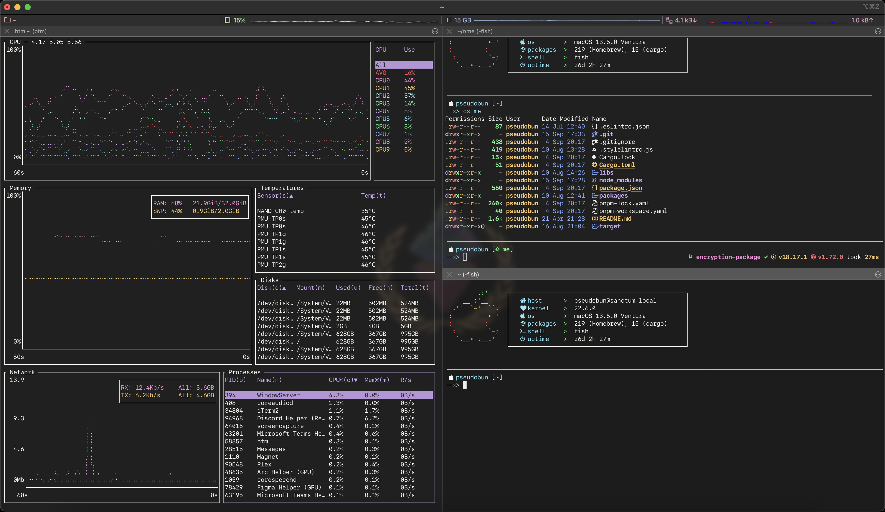

# Personal Workspace Configuration

This repository contains configuration files and images for my personal workspace (iTerm config and desktop wallpapers). Wallpaper assets used have been downloaded from [Ethereum's official Assets site](https://ethereum.org/en/assets/).

## Configuration in action:


## fish
I use `fish` as my default shell. Check out [their repo](https://github.com/fish-shell/fish-shell). Additionally I use [oh-my-fish](https://github.com/oh-my-fish/oh-my-fish).

### Install fish
`brew install fish`

### Install oh-my-fish (omf)
`curl https://raw.githubusercontent.com/oh-my-fish/oh-my-fish/master/bin/install | fish`

## Install fonts 

1. Install Liga SFMono Nerd Font
   
    I switched to Liga SFMono because of the Nerd Font support. For customizable installation follow the instructions in [their repo](https://github.com/shaunsingh/SFMono-Nerd-Font-Ligaturized).

    ```bash
    brew tap shaunsingh/SFMono-Nerd-Font-Ligaturized
    brew install --cask font-sf-mono-nerd-font-ligaturized
    ```

2. Install the fonts included ([JetBrains Mono](/fonts/JetBrainsMono/) or [Roboto Mono](/fonts/RobotoMono/)).
   1. Click on desired `.tiff` files and click install.

## Customize prompt

Installing `omf` by default creates some directories at `~/.local/share/omf`.

To install my custom omf theme:

1. `mkdir -p ~/.local/share/omf/themes/pseudobun/functions`.
2. Copy all files from [`functions`](/functions/) to the directory created in the previous step.
3. Run `omf theme pseudobun` to set the theme.

## Set iTerm colors
1. Open iTerm2.
2. Go to `iTerm > Preferences > Profiles > Colors > Color Presets ...`.
3. Pick `Flowerish.itermcolors`.

## Import key bindings and profile
1. Open iTerm2.
2. Go to `iTerm > Preferences > Profiles > Other actions ... > Import JSON profiles ...`.
3. Pick `/profiles/pseudobun.json` from this repo.
4. Go to `iTerm > Preferences > Keys > Key Bindings > Presets ... > Import ...`.
5. Pick `profiles/pseudobun.itermkeymap` from this repo.

## Macchina
To display the ascii art and info about my machine I use [Macchina](https://github.com/Macchina-CLI/macchina) with `pseudobun` theme (adapted from default theme). Install Macchina and add the [pseudobun theme](/macchina/pseudobun.toml) into themes folder (default at `~/.config/macchina/themes`).

## Awesome UNIX tools
Besides that I use some of the awesome UNIX tools provided in [this repo](https://github.com/ibraheemdev/modern-unix).